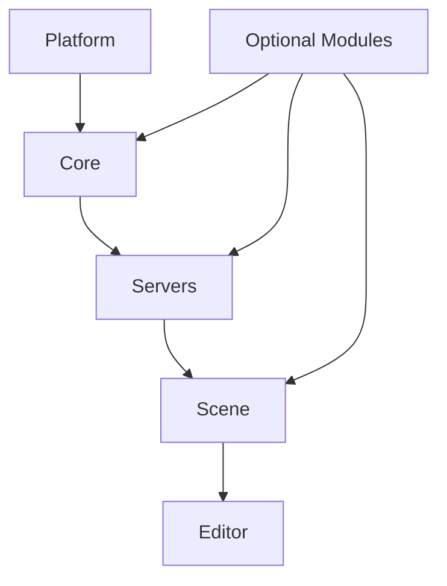
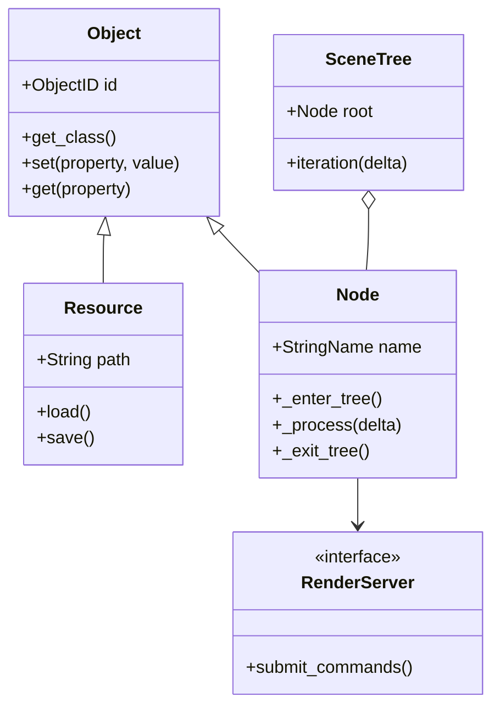
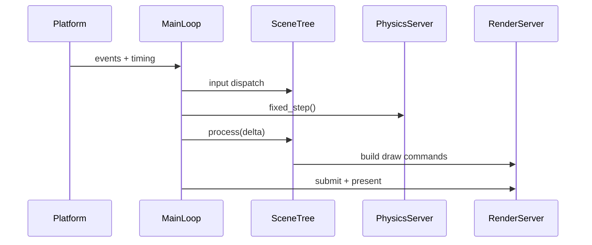
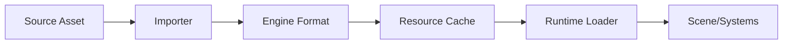

# UML Diagrams

The following Mermaid diagrams describe the main structural and runtime relationships.

## Layered Architecture

## Core Class Relationships

## Frame Sequence

## Asset Import Flow

